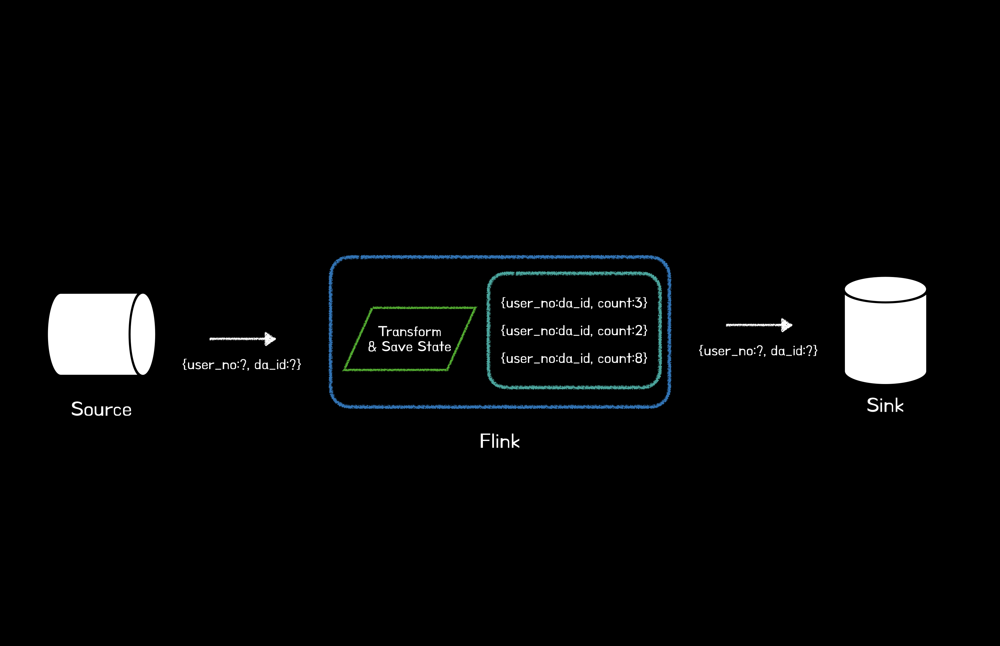

# 들어가며

이번 글에서는 광고 빈도 제한(Frequency Capping)을 Flink로 제공하며 사용한 KeyedProcessFunction을 활용한 상태 관리와 그에 관한 몇 가지 트릭(Trick)을 소개한다. Flink의 Concept과 기본적인 개념들을 알고 있다는 가정하에 글을 작성한다. 또한 자세한 코드보다 흐름을 알 수 있는 코드 정도만 제공한다.

# Background

광고 빈도 제한을 위한 기본적인 요구 사항은 다음과 같다.

- 유저 단위로 5일동안 어떠한 광고를 N번 이상 보면 해당 유저와 광고를 Redis에 Sink해주세요.

위 요구사항을 위해 크게 아래와 같은 구조를 생각했다.

1. Kafka(Source)에서 사용자와 광고에 대한 정보를 Consume한다.
2. Flink에서 user_no와 da_id를 기준으로 한 유저가 어떤 광고를 몇 번 봤는지 집계(Aggregation)한다.
3. 빈도 제한 Threshold(N)에 다다른 유저(user_no)와 광고 상태(da_id)는 Redis(Sink)에 Sink된다.

그림으로 쉽게 표현하면 아래와 같다.



# KeyedProcessFunction

Flink 공식 문서에서는 KeyedProcessFunction에 대해 다음과 같이 설명한다.

> KeyedProcessFunction은 ProcessFunction의 확장으로, onTimer 메서드 내에서 Timer의 키에 대한 접근 권한을 제공한다.

```kotlin
class AdsProcessor: KeyedProcessFunction<Long, AdsInfo, Long>() {

    override fun open(parameters: Configuration?) {
        super.open(parameters)
    }

    override fun processElement(AdsInfo: Long, p1: Contexxt?, p2: Collector<Long>?) {
        TODO("Not yet implemented")
    }

    override fun onTimer(timestamp: Long, ctx: OnTimerContext?, out: Collector<Long>?) {
        super.onTimer(timestamp, ctx, out)
    }

}
```

# Timer

여기서 가장 중요한 키워드는 `타이머`이다. KeyedProcessFunction은 WindowFunction과 달리 정해진 집계 기간이 없기 때문에 사용자는 타이머를 활용하여 상태를 직접 관리/설정/만료 시켜야 한다.

타이머는 processing time과 event time 2가지 유형으로 설정할 수 있으며, 내부적으로는 TimerService에서 관리하기 위해 큐(Queue)에 등록한다.

또한 Key와 Timestamp는 중복으로 존재할 수 없기 때문에 Key와 Timestamp 당 최대 하나의 타이머가 존재한다. 동일한 타임스탬프에 여러 타이머가 등록된 경우는 onTimer(State의 Timer가 만료되었을 때 실행되는 메서드)가 단 한 번만 실행된다.

또한 Flink는 processElement와 onTimer 메서드의 호출을 동기처리하기 때문에 사용자는 State에 대한 동시 수정에 대해 걱정하지 않아도 된다.

## Timer로 상태 관리하기

상태를 관리하기 위해서는 당연하게도 먼저 KeyedProcessFunction에서 관리할 상태를 만들어야 한다.

```kotlin
private lateinit var viewedStat: MapState<String, Long>
```

상태는 MapState와 ValueState로 만들 수 있으며, 필자는 유저 당 광고 조회수를 집계해야 하기 때문에 MapState를 활용했다. 참고로 `ValueState<Map<String, Long>>`과 같은 형태도 사용할 수 있지만, O(n^2)의 시간 복잡도를 가지기 때문에 스트리밍에서는 매우 비효율적이다.

## 상태 관리의 방식: HashMapStateBackend vs EmbeddedRocksDBStateBackend

상태 관리를 위해 Flink는 두 가지 주요 상태 백엔드를 제공한다.

1. HashMapStateBackend: 자바의 Heap 메모리를 기반으로 빠른 상태 접근이 가능한 백엔드
   - 적합한 경우: 작은 상태 크기와 빠른 접근 속도가 중요한 경우
   - 장점: 자바 힙 메모리에서 객체 상태로 관리하기 때문에 `직렬화/역직렬화` 비용이 들지 않음
   - 단점: JVM `힙 메모리에 제약`이 있음
2. EmbeddedRocksDBStateBackend: 디스크와 메모리를 함께 활용하여 대규모 상태를 관리
   - 적합한 경우: 대규모 상태 관리 및 긴 기간의 윈도우가 필요한 경우
   - 장점: 디스크 기반으로 상태 크기에 제한이 없으면 `증분 스냅샷`을 지원
   - 단점: 데이터를 바이트 형태로 관리하기 때문에 `직렬화/역직렬화` 비용이 듦

### 1. HashMapStateBackend

HashMapStateBackend는 Java의 힙(Heap) 메모리에 데이터를 저장한다. Key/Value State 및 Window 연산자는 Value, Trigger 등을 저장하는 해시 테이블을 저장한다.

하지만, EmbeddedRocksDBStateBackend와 달리 HashMapStateBackend는 데이터를 힙에 객체로 저장하므로 객체를 재사용하는 것이 안전하지 않을 수 있으며, 상태 크기에 제약이 있다.

### 2. EmbeddedRocksDBStateBackend

EmbeddedRocksDBStateBackend(이하 RocksDB)는 RocksDB라는 데이터베이스를 활용하여 데이터를 보관하며, 기본적으로 분산 파일 시스템(DFS, Distributed File System)에 상태를 저장한다.

Java 객체를 저장하는 것과 달리 주로 직렬화된 바이트(Byte) 배열로 저장되므로 Java 객체의 `hashCode().equals()`를 활용하는 대신 바이트 단위로 키 비교가 이루어 진다.

또한 RocksDB는 항상 비동기 스냅샷을 수행한다. 특히 상태의 크기는 JVM의 힙 메모리에 따라 결정되는 HashMapStateBackend와 달리, DFS의 디스크 공간에 의해 제한된다는 점이 매우 큰 상태를 다룰 때 매력적이다.

하지만 RocksDB를 상태 백엔드로 사용할 때는 상태를 읽고/쓸 때 항상 직렬화/역직렬화를 거쳐야하기 때문에 힙 기반 상태 백엔드에 비해 처리량이 낮고, 비용이 더 많이 들 수는 있다.

### 상태 백엔드 결정하기

HashMapStateBackend와 EmbeddedRocksDBStateBackend 중 무엇을 채택할지는 성능과 확장성을 고려해야 한다. HashMapStateBackend는 각 상태 액세스 및 업데이트가 힙 메모리에서 동작하기 때문에 매우 빠르지만, 상태 크기에 대한 제한적인 부분이 있다.

반면, RocksDB는 메모리와 디스크를 모두 사용하기 때문에 디스크 공간에 따라 관리할 수 있는 상태의 크기가 매우 커질 수 있다. 또한 RocksDB는 Flink에서 `증분 스냅샷`을 지원하는 유일한 상태 백엔드다.

필자는 매우 큰 상태(N00GB)를 관리해야 했기 때문에 EmbeddedRocksDBStateBackend를 선택했다. 또한 RocksDB는 LSM(로그 구조 병합 트리), Mem 및 SST 테이블 등 최적화 기법을 사용하기 때문에 성능 상에서도 크게 문제가 있지는 않다.

> #### 증분 스냅샷이란?
>
> - 차이점만 저장: RocksDB 증분 스냅샷은 이전 체크포인트와의 차이점만 저장한다. 일반적인 체크포인트 방식에서는 전체 상태를 매번 저장하지만, 증분 스냅샷은 변경된 부분만 저장하므로 스토리지 사용량이 크게 줄어든다.
> - 빠른 저장 및 복구: 증분 스냅샷은 변경된 데이터만 저장하므로 체크포인트 저장 속도가 빨라진다. 또한 복구할 때에도 필요한 부분만 복구하면 되기 때문에 전체 복구 시간도 단축된다.
> - Flink와 RocskDB의 통합 활용: RocksDB는 SST 파일(Sorted String Table)을 사용해 키-값 데이터를 효율적으로 관리하는데, 이러한 구조를 활용하여 SST 파일의 변경된 부분만 캡처하여 사용한다.

## EmbeddedRocksDBStateBackend 적용하기

다시 돌아와서 상태 백엔드를 EmbeddedRocksDBStateBackend로 설정하기 위해서는 다음과 같이 사용하면 된다. CustomRocksDBOptionFactory는 튜닝이 필요할 때 유지보수의 편리함을 위해 만들었다. (아래 상태는 기본 값)

```kotlin
val env = StreamExecutionEnvironment.getExecutionEnvironment()
val rocksDBBackend = EmbeddedRocksDBStateBackend(true) // true: 증분 스냅샷 활성화
rocsDBBackend.rocksDBOptions = CustomRocksDBOptionFactory()
env.setStateBackend(rocksDBBackend)

class CustomRocksDBOptionFactory : RocksDBOptionsFactory {

    override fun createDBOption(
        p0: DBOptions?,
        p1: MutableCollecion<AutoCloseable>?
    ): DBOptions {
        val dbOptions = p0 ?: DBOptions()
        return dbOptions
    }

    override fun createColumnOptions(
        p0: ColumnFamilyOptions?,
        p1: MutableCollection<AutoCloseable>?
    ): ColumnFamilyOptions {
        val columnOptions = p0 ?: ColumnFamilyOptions()
        columnOptions.setCompactionStyle(LEVEL)
        columnOptions.setCompressionType(SNAPPY_COMPRESSION)
        return columnOptions
    }
}
```

KeyedProcessFunction에서는 주로 상태의 만료(expire)에 관련한 설정을 한다.

```kotlin
class AdsProcessor : KeyedProcessFunction<Long, AdsInfo, Long>() {

    private lateinit var viewedState: MapState<String, Long>

    override fun open(paramenters: Configuration?) {
        val ttlConfig = StateTtlConfig
            .newBuilder(Time.days(7))
            .setUpdateType(StateTtlConfig.UpdateType.OnCreateAndWrite)
            .setStateVisibility(StateTtlConfig.StateVisibility.NeverReturnExpired)
            .build()

        val adsViewedStateDescriptor = MapStateDescriptor("adsViewedState", String::class.java)
        adsViewedStateDescriptor.enableTimeToLive(ttlConfig)
        viewedState = runtimeContext.getMapState(adsViewedStateDescriptor)
    }
}
```

- Time.days(7): 상태는 일주일만 관리한다. 일주일이 지나면 삭제된다.
- StateTtlConfig.UpdateType.OnCreateAndWrite: 상태가 처음 생성되거나, 상태에 새로운 값이 쓰일 때마다 TTL을 갱신한다.
  - 생성 시: 상태가 처음 생성되었을 때 TTL이 설정되며, 이 TTL은 생성 시각을 기준으로 시작된다.
  - 쓰기 시: 상태에 새로운 값이 쓸 때마다 TTL이 다시 갱신된다. 즉, 상태의 유효 기간이 매번 연장되는 효과가 있다.
  - 읽기 시: TTL 갱신이 없으며, 마지막 쓰기 시각을 기준으로 TTL이 만료된다.
- StateTtlConfig.StateVisibility.NeverReturnExpired: 만료된 상태를 반환하지 않는다. 만료된 상태에 접근하려고 하면 해당 상태는 존재하지 않는 것 처럼 취급한다. `ReturnExpiredIfNotCleanUp`으로 설정하면 TTL이 지난 상태에서도 읽을 수 있다.

## 상태 집계하기

이제 상태를 집계해보자. 유저(userNO)가 어떤 광고(daId)를 몇 번 봤는지 알고 있어야 하기 때문에 userNo와 daId를 기준으로 grouping한 key를 만들었다. value는 조회수를 나타낸다.

```kotlin
override fun processElement(event: AdsInfo, p1: Context?, out: Collector<Long>?) {
    val stateKey = "${event.userNo}:${event.daId}"
    val currentState = (viewedState.get(stateKey) ?: 0) + 1
    viewedState.put(stateKey, currentState)
}
```

## 타이머 설정하기

이 다음으로 가장 중요한 처리가 남아있다. 우리는 들어오는 모든 상태를 영원히 Append만 해서 되는 것이 아닌 최근 5일 동안의 데이터만 집계해야 하는 것이다. 즉, 오래된 상태(5일이 지난 데이터)는 제거해줘야 한다. 그러기 위해서는 위에서 간단하게 설명한 Timer를 설정할 수 있다.

```kotlin
private fun setTimer(ctx: Context) {
    val currentTime = ctx.timerService().currentProcessingTime()
    ctx.timerService().registerProcessingTimeTimer(currentTime + Time.days(5).toMilliseconds())
}
```

그런데 여기에는 여러가지 문제점들이 있다.

1. Flink의 processingTime을 기준으로 타이머를 설정하기 때문에 스트리밍 초기에 kafka에서 earliest로 메세지를 컨슘할 때, 3일전 데이터라도 현재 시간을 기준으로 타이머가 설정된다는 것이다.
   - 예를 들어 오늘이 2024/10/5일인데, 2024/10/2일 데이터의 타이머는 2024/10/2일 + 5일로 설정되어야 함에도 불구하고, processingTime이 오늘이라면 2024/10/5일 + 5일로 설정되는 것이다.
2. onTimer 메서드에서 만료된 값을 알 수 없다.

   ```kotlin
   override fun onTimer(
           timestamp: Long,
           ctx: KeyedProcessFunction<Long, AdsInfo, Long>.OnTimerContext,
           out: Collector<Long>
   ) {
   	//...
   }
   ```

   - onTimer에서는 만료된 상태의 value에서 -1을 해주어야하고, 만약 value가 1이라면 key를 제거해줘야 한다.
   - 하지만, 위 메서드 시그니처에서 만료된 상태가 무엇인지 어떻게 알 수 있을까? 지금 상태에서는 어떤 방법을 사용해도 알 수 없을 것이다.

### Trick1. Timer 설정은 Flink Processing Time 대신 Event의 Processing Time을 활용하자

> Flink의 processingTime을 기준으로 타이머를 설정하기 때문에 스트리밍 초기에 kafka에서 earliest로 메세지를 컨슘할 때, 3일전 데이터라도 현재 시간을 기준으로 타이머가 설정된다는 것이다.

위 문제는 Timer를 설정할 때의 기준이 Flink의 ProcessingTime이기 때문이다. 그렇다면, Event의 Processing Time을 활용하면 어떨까? Kafka 토픽의 메세지에는 logTime이라는 필드가 존재하는데, 해당 필드는 이벤트의 Processing Time을 나타낸다.

따라서 Event의 logTime을 기준으로 Timer를 설정하면 문제가 해결될 것이다.

```kotlin
private fun setTimer(ctx: Context, event: AdsInfo) {
    val timerTime = event.getAfter3dInMillis()
    ctx.timerService().registerProcessingTimeTimer(timerTime)
}
```

### Trick2. 타이머에 대한 적절한 상태 정보를 추가로 관리하자

> 위 메서드 시그니처에서 만료된 상태가 무엇인지 어떻게 알 수 있을까? 지금 상태에서는 어떤 방법을 사용해도 알 수 없을 것이다.

이 문제의 근본적인 원인은 타이머 만료에 대한 상태 정보가 부족하기 때문이다. 타이머가 만료되었을 때 알 수 있는 정보들을 기반으로 적절한 상태를 추가해주면 어떨까?

```kotlin
private lateinit var viewedState: MapState<String, Long>
private lateinit var timerState: MapState<String, String>

//...

private fun setTimer(ctx: Context, event: AdsInfo) {
    val timerTime = event.getAfter3dInMillis()
    timerState.put(timerTime.toString(), "${event.userNo}:${event.daAdvertiseSetId}")
    ctx.timerService().registerProcessingTimeTimer(timerTime)
}

override fun onTimer(
    timestamp: Long,
    ctx: KeyedProcessFunction<Long, AdsExposureEvent, DaViewedState>.OnTimerContext,
    out: Collector<DaViewedState>
) {
    val timerKey = "$timestamp"
    val timerInfo = timerState.get(timerKey)

    if (timerInfo != null) {
        val updatedViewed = viewedState.get(timerInfo) - 1
        // ... 적절한 처리
    }
}
```

이렇게 타이머가 만료될 때 해당 시간의 timestamp를 제공하는 점을 이용하여 timerState 하나를 더 관리할 수 있다. 또는 viewedState key prefix로 timestamp를 추가하는 방법을 사용할 수도 있다.

# About Performance

---

- `RocksDB 최적화`: 블룸 필터 설정은 키 탐색 속도를 높이고, 압축 알고리즘(Snappy, LZ4 등)을 선택해 디스크 사용량과 성능을 조절할 수 있다. 또한 블록 캐시 크기를 조절하면 RocksDB의 I/O 성능을 개선할 수도 있다.
- `병렬성(Parallelism) 조정` 작업의 병렬성을 조정하여 처리량을 늘리거나 줄일 수 있다.
  - 주의할 점은 Source가 Kafka일 때 Source Topic의 파티션의 개수보다 많은 병렬성을 지정하는건 자원만 낭비할 뿐 의미가 없다.
  - 그렇다면, Source에서 Consume하는 Operator에만 파티션 수에 맞는 병렬성을 주고, 그 뒤의 Operator들에게는 많은 병렬성을 할당하고 싶으면 어떻게 할 수 있을까?
- `Operator Chaining 설정`: CPU Intensive Operator를 위해 직접 operator chaining(disableChaining, startChaning)을 분리해서 사용하는 튜닝 기법이다.
  - Flink는 사용자가 명시적으로 파티셔닝(rebalance, shuffle, rescale, keyby 등)을 하지 않으면 모두 하나의 Task로 묶여서 실행된다.
  - 따라서 startChaining, disableChaining을 통해 source에서 consume하는 부분과 CPU Intensive한 Operator들을 나누어 Chaining하면 태스크 간의 리소스 격리로 인한 비약적인 성능 개선을 기대할 수 있다.
- `Checkpoint 설정`: 체크포인팅 주기를 적절히 설정한다.
  - 너무 잦은 체크포인팅이나, 적절하지 않은 압축 방식은 성능에 해가 될 수도 있다.
  - 또한 Flink의 Source가 2개 이상인 경우나 체크포인팅에서 병목이 발생한다면, unaligned checkpointing을 주목하자.
- `State ttl 설정`: State의 TTL 주기를 적절히 설정한다.
  - 너무 잦은 State TTL 설정은 TaskManager에게 매우 많은 부하를 발생시키며, 이로 인한 병목이 상당하다.
  - 이러한 관점에서 데이터 유입량이 많은 피크 시간대 onTimer가 한 번에 많이 일어나지 않게 State TTL에 적절한 지터(jitter)를 주는 방법도 있다.
- `공통 필터 적용`: 모든 Task에 공통적으로 적용되는 필터는 앞부분에서 적절히 필터하여 여러 Process에 분산되지 않게 한다.
- `파티셔닝 주의하기`: 명시적으로 설정한 파티셔닝이 적절한지 확인한다.
  - 사용자의 명시적인 파티셔닝(특히 KeyedProcessFunction에서는 keyBy)을 할 때 TaskManager 간의 Skew(데이터 불균형)가 일어나지 않도록 해야한다.
  - keyBy 이후 불필요한 파티셔닝(rebalance, shuffle)등은 최대한 지양한다. (TM간의 데이터 교환 네트워크 비용이 들기 때문)
